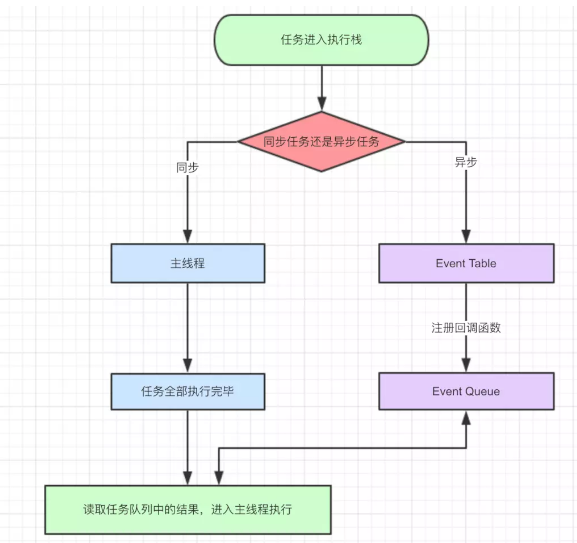
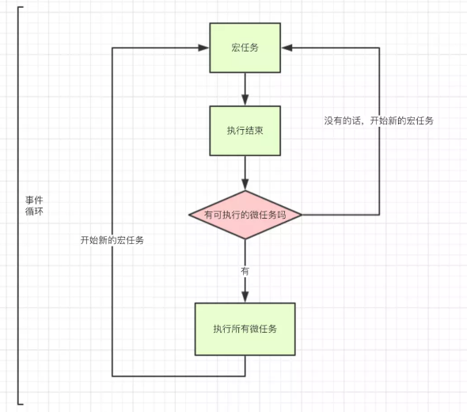

# jsLearn
js学习

## 框架这一块 ，由于书籍后半部分比较晦涩， 也暂时没有接触， 所以只能算是一个入门和引导方向(放在__js代码__中的)

## h5中以后用到了在加入

## test.js中是一些入门知识的代码测试

## 执行流程
1. macro-task(宏任务)：包括整体代码script，setTimeout，setInterval
2. micro-task(微任务)：Promise，process.nextTick


> 事件循环



[链接](https://juejin.im/post/5ca2e1935188254416288eb2)
## 新特性 
## ES6
* 获取对象中的值(es6)
    const student = {
    name:'Ming',
    age:'18',
    city:'Shanghai'  
    };

* var name = `Your name is ${first} ${last}.`
    在ES6中通过${}就可以完成字符串的拼接，只需要将变量放在大括号之中。
    const {name,age,city} = student;
* var arr2 = [...arr]; // 等同于 arr.slice() 数组拷贝

* 在ECMAScript 2018中延展操作符增加了对对象的支持
    var obj1 = { foo: 'bar', x: 42 };
    var obj2 = { foo: 'baz', y: 13 };

    var clonedObj = { ...obj1 };
    // 克隆后的对象: { foo: "bar", x: 42 }

    var mergedObj = { ...obj1, ...obj2 };
    // 合并后的对象: { foo: "baz", x: 42, y: 13 }

* const name='Ming',age='18',city='Shanghai';
  
    const student = {
        name,
        age,
        city
    };
    console.log(student);//{name: "Ming", age: "18", city: "Shanghai"}
* Promise 是异步编程的一种解决方案，比传统的解决方案callback更加的优雅。它最早由社区提出和实现的，ES6 将其写进了语言标准，统一了    用法，原生提供了Promise对象。

    不使用ES6

    嵌套两个setTimeout回调函数：
    setTimeout(function()
    {
        console.log('Hello'); // 1秒后输出"Hello"
        setTimeout(function()
        {
            console.log('Hi'); // 2秒后输出"Hi"
        }, 1000);
    }, 1000);

    使用ES6

    var waitSecond = new Promise(function(resolve, reject)
    {
        setTimeout(resolve, 1000);
    });

    waitSecond
        .then(function()
        {
        console.log("Hello"); // 1秒后输出"Hello"
        return waitSecond;
        })
        .then(function()
        {
            console.log("Hi"); // 2秒后输出"Hi"
        });

    复制代码上面的的代码使用两个then来进行异步编程串行化，避免了回调地狱：
----
----
##ES7新特性（2016）
ES2016添加了两个小的特性来说明标准化过程：

* 数组includes()方法，用来判断一个数组是否包含一个指定的值，根据情况，如果包含则返回true，否则返回false。
* a ** b指数运算符，它与 Math.pow(a, b)相同。

## ES8新特性（2017）

1. async/await
    因此await可以和for...of循环一起使用，以串行的方式运行异步操作。例如：
    ```
    async function process(array) {
        for await (let i of array) {
            doSomething(i);
        }
    }
    ```

2. Object.values() 返回的是Object自身属性的所有值，不包括继承的值。
3. Object.entries()  函数返回一个给定对象自身可枚举属性的键值对的数组。
```
for(let [key,value] of Object.entries(obj1)){
	console.log(`key: ${key} value:${value}`)
}
```
4. String padding: padStart()和padEnd()，填充字符串达到当前长度
5. 函数参数列表结尾允许逗号
6. Object.getOwnPropertyDescriptors()
7. ShareArrayBuffer和Atomics对象，用于从共享内存位置读取和写入
    * SharedArrayBuffer 对象用来表示一个通用的，固定长度的原始二进制数据缓冲区，类似于 ArrayBuffer 对象，它们都可以用来在共享内存（shared memory）上创建视图。与 ArrayBuffer 不同的是，SharedArrayBuffer 不能被分离。

    * Atomics 对象提供了一组静态方法用来对 SharedArrayBuffer 对象进行原子操作
    多个共享内存的线程能够同时读写同一位置上的数据。原子操作会确保正在读或写的数据的值是符合预期的，即下一个原子操作一定会在上一个原子操作结束后才会开始，其操作过程不会中断。

## ES9新特性（2018）

1. 异步迭代
2. Promise.finally()
3. Rest/Spread 属性
4. 正则表达式命名捕获组（Regular Expression Named Capture Groups）
5. 正则表达式反向断言（lookbehind）
6. 正则表达式dotAll模式
7. 正则表达式 Unicode 转义
8. 非转义序列的模板字符串


## 试题
> [链接：](https://juejin.im/post/5b1f899fe51d4506c60e46ee)
> 来源：掘金
1. switch 中 使用 === 来判断是否和 case的值相等
2. 基本类型 Number(1) === 1  , String('A') === 'A'
3. Infinity % 2  //NaN  Infinity 是无穷大  
4. -9 % 2        // -1
5. Array.prototype是一个数组  数组的原型是数组，对象的原型是对象，函数的原型是函数
6. [0]的boolean值是true
7. []== ![] 
     (1)! 的优先级高于== ，右边Boolean([])是true,取返等于 false
     (2)一个引用类型和一个值去比较 把引用类型转化成值类型，左边0
     (3)所以 0 == false  答案是true
8.  function(a = 1, b , c) 当参数使用初始化赋值的话 es6就使用了严格模式
（1）严格模式arguments对象是传入函数内实参列表的静态副本；非严格模式下，指向同一个值的引用 
（2）严格模式变量必须先声明，才能使用
（3）严格模式中 call apply传入null undefined保持原样不被转换为window
9. MIN_VALUE 属性是 JavaScript 中可表示的最小的数（接近 0 ，但不是负数）。它的近似值为 5 x 10-324。
10. 1 < 2    =>  true;
    true < 3 =>  1 < 3 => true;
      
    3 < 2     => false;
    false < 1 => 0 < 1 => true;
11. 
3.toString()
3..toString()
3...toString()


答案：error, "3", error
解析：因为在 js 中 1.1, 1., .1 都是合法的数字. 那么在解析 3.toString 的时候这个 . 到底是属于这个数字还是函数

12. 
var a = /123/,
b = /123/;
a == b
a === b
这段代码的执行结果？

答案：false, false
解析：正则是对象，引用类型，相等（==）和全等（===）都是比较引用地址

13. 
var a = [1, 2, 3],
b = [1, 2, 3],
c = [1, 2, 4]
a ==  b
a === b
a >   c
a <   c
这段代码的执行结果？

答案：false, false, false, true
解析：相等（==）和全等（===）还是比较引用地址
     引用类型间比较大小是按照字典序比较，就是先比第一项谁大，相同再去比第二项。
14. 
var a = {}, b = Object.prototype;
[a.prototype === b, Object.getPrototypeOf(a) === b]    

这段代码的执行结果？
答案：false, true
解析：Object 的实例是 a，a上并没有prototype属性
     a的__poroto__ 指向的是Object.prototype，也就是Object.getPrototypeOf(a)。a的原型对象是b


15. 
function f() {}
var a = f.prototype, b = Object.getPrototypeOf(f);
a === b         

这段代码的执行结果？
答案：false
解析：a是构造函数f的原型 ： {constructor: ƒ}
     b是实例f的原型对象 ： ƒ () { [native code] }

16. 
function foo() { }
var oldName = foo.name;
foo.name = "bar";
[oldName, foo.name]     

这段代码的执行结果？
答案：["foo", "foo"]
解析：函数的名字不可变.

17. 
"1 2 3".replace(/\d/g, parseInt)
答案："1 NaN 3"

解析：replace() 回调函数的四个参数:
      1、匹配项  
      2、与模式中的子表达式匹配的字符串  
      3、出现的位置  
      4、stringObject 本身 。
如果没有与子表达式匹配的项，第二参数为出现的位置.所以第一个参数是匹配项，第二个参数是位置
 parseInt('1', 0)
 parseInt('2', 2)  //2进制中不可能有2
 parseInt('3', 4)
巩固：
   "And the %1".replace(/%([1-8])/g,function(match,a , b ,d){
      console.log(match +"  "+ a + " "+ b +" "+d )
    });
   //%1  1 8 And the %1 

18. 
"1 2 3".replace(/\d/g, parseInt)
答案："1 NaN 3"

解析：replace() 回调函数的四个参数:
      1、匹配项  
      2、与模式中的子表达式匹配的字符串  
      3、出现的位置  
      4、stringObject 本身 。
如果没有与子表达式匹配的项，第二参数为出现的位置.所以第一个参数是匹配项，第二个参数是位置
 parseInt('1', 0)
 parseInt('2', 2)  //2进制中不可能有2
 parseInt('3', 4)
巩固：
   "And the %1".replace(/%([1-8])/g,function(match,a , b ,d){
      console.log(match +"  "+ a + " "+ b +" "+d )
    });
   //%1  1 8 And the %1 

19. 
var lowerCaseOnly =  /^[a-z]+$/;
lowerCaseOnly.test(null), lowerCaseOnly.test()]

这段代码的执行结果？
答案：[true, true]
解析：这里 test 函数会将参数转为字符串. 'nul', 'undefined' 自然都是全小写了

20. 
[,,,].join(",")

答案：",,"
解析：因为javascript 在定义数组的时候允许最后一个元素后跟一个,
     所以这个数组长度是3，
巩固： [,,1,].join(".").length //  3 

21. 
var a = Function.length, // 1
b = new Function().length // 0
a === b

这段代码的执行结果？
答案：false
解析：首先new在函数带（）时运算优先级和.一样所以从左向右执行
     new Function() 的函数长度为0
巩固：function fn () {
         var a = 1;
      }
      console.log(fn.length) 
      //0 fn和new Function()一样

22. 
var min = Math.min(), max = Math.max()
min < max

这段代码的执行结果？
答案：false
解析： Math.min 不传参数返回 Infinity, Math.max 不传参数返回 -Infinity ，Infinity应该大于-Infinity,所以是false
     
巩固：Number.MAX_VALUE  > Number.MIN_VALUE  //true

23. 
function foo(a) {
  var a;
  return a;
}
function bar(a) {
    var a = 'bye';
    return a;
}
[foo('hello'), bar('hello')]

这段代码的执行结果？

答案：["hello", "bye"]
解析：最后一题很简单吧，变量声明


