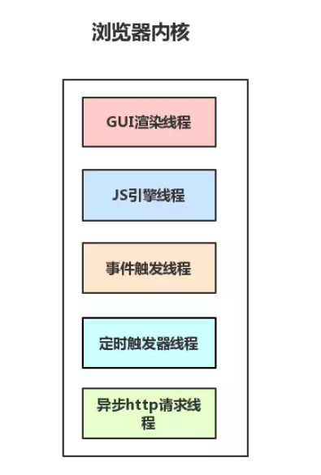
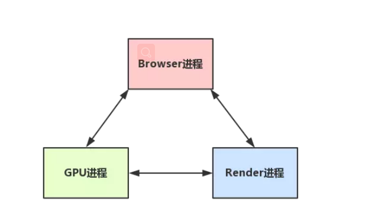

## 进程  线程

* 区分进程和线程
* 浏览器是多进程的
* 浏览器都包含哪些进程？
* 浏览器多进程的优势
* 重点是浏览器内核（渲染进程）
* Browser进程和浏览器内核（Renderer进程）的通信过程
* 梳理浏览器内核中线程之间的关系
* GUI渲染线程与JS引擎线程互斥
* JS阻塞页面加载
* WebWorker，JS的多线程？
* WebWorker与SharedWorker
* 简单梳理下浏览器渲染流程
* load事件与DOMContentLoaded事件的先后
* css加载是否会阻塞dom树渲染？
* 普通图层和复合图层
* 从Event Loop谈JS的运行机制
* 事件循环机制进一步补充
* 单独说说定时器
* setTimeout而不是setInterval
* 事件循环进阶：macrotask与microtask

[链接](https://juejin.im/post/5a6547d0f265da3e283a1df7)

 1. 进程是cpu资源分配的最小单位（是能拥有资源和独立运行的最小单位）

 2. 线程是cpu调度的最小单位（线程是建立在进程的基础上的一次程序运行单位，一个进程中可以有多个线程）

浏览器是多进程的
理解了进程与线程了区别后，接下来对浏览器进行一定程度上的认识：（先看下简化理解）

## 浏览器是多进程的

1. 浏览器之所以能够运行，是因为系统给它的进程分配了资源（cpu、内存）

2. 简单点理解，每打开一个Tab页，就相当于创建了一个独立的浏览器进程。
> 在这里浏览器应该也有自己的优化机制，有时候打开多个tab页后，可以在Chrome任务管理器中看到，有些进程被合并了 （所以每一个Tab标签对   应一个进程并不一定是绝对的）

#知道了浏览器是多进程后，再来看看它到底包含哪些进程：（为了简化理解，仅列举主要进程）

* Browser进程：浏览器的主进程（负责协调、主控），只有一个。作用有
* 负责浏览器界面显示，与用户交互。如前进，后退等
* 负责各个页面的管理，创建和销毁其他进程
* 将Renderer进程得到的内存中的Bitmap，绘制到用户界面上
* 网络资源的管理，下载等
* 第三方插件进程：每种类型的插件对应一个进程，仅当使用该插件时才创建
* GPU进程：**最多一个**，用于3D绘制等
* 浏览器渲染进程（浏览器内核）（Renderer进程，内部是多线程的）：默认每个Tab页面一个进程，互不影响。主要作用为
>> 页面渲染，脚本执行，事件处理等

## 重点是浏览器内核（渲染进程）
重点来了，我们可以看到，上面提到了这么多的进程，那么，对于普通的前端操作来说，最终要的是什么呢？答案是渲染进程
可以这样理解，**页面的渲染，JS的执行，事件的循环**，都在这个进程内进行。接下来重点分析这个进程
请牢记，浏览器的渲染进程是多线程的（这点如果不理解，请回头看进程和线程的区分）

那么接下来看看它都包含了哪些线程（列举一些主要常驻线程）：

1. GUI渲染线程

    负责渲染浏览器界面，解析HTML，CSS，构建DOM树和RenderObject树，布局和绘制等。
    当界面需要重绘（Repaint）或由于某种操作引发回流(reflow)时，该线程就会执行
    注意，GUI渲染线程与JS引擎线程是互斥的，当JS引擎执行时GUI线程会被挂起（相当于被冻结了），GUI更新会被保存在一个队列中等到JS引擎空闲时立即被执行。

2. JS引擎线程

    也称为JS内核，负责处理Javascript脚本程序。（例如V8引擎）
    JS引擎线程负责解析Javascript脚本，运行代码。
    JS引擎一直等待着任务队列中任务的到来，然后加以处理，一个Tab页（renderer进程）中无论什么时候都只有一个JS线程在运行JS程序
    同样注意，GUI渲染线程与JS引擎线程是互斥的，所以如果JS执行的时间过长，这样就会造成页面的渲染不连贯，导致页面渲染加载阻塞。

3. 事件触发线程

    归属于浏览器而不是JS引擎，用来控制事件循环（可以理解，JS引擎自己都忙不过来，需要浏览器另开线程协助）
    当JS引擎执行代码块如setTimeOut时（也可来自浏览器内核的其他线程,如鼠标点击、AJAX异步请求等），会将对应任务添加到事件线程中
    当对应的事件符合触发条件被触发时，该线程会把事件添加到待处理队列的队尾，等待JS引擎的处理
    注意，由于JS的单线程关系，所以这些待处理队列中的事件都得排队等待JS引擎处理（当JS引擎空闲时才会去执行）

4. 定时触发器线程

    传说中的setInterval与setTimeout所在线程
    浏览器定时计数器并不是由JavaScript引擎计数的,（因为JavaScript引擎是单线程的, 如果处于阻塞线程状态就会影响记计时的准确）
    因此通过单独线程来计时并触发定时（计时完毕后，添加到事件队列中，等待JS引擎空闲后执行）
    注意，W3C在HTML标准中规定，规定要求setTimeout中低于4ms的时间间隔算为4ms。

5. 异步http请求线程
    在XMLHttpRequest在连接后是通过浏览器新开一个线程请求
    将检测到状态变更时，如果设置有回调函数，异步线程就产生状态变更事件，将这个回调再放入事件队列中。再由JavaScript引擎执行。

##如果自己打开任务管理器，然后打开一个浏览器，就可以看到：任务管理器中出现了两个进程（一个是主控进程，一个则是打开Tab页的渲染进程），然后在这前提下，看下整个的过程：(简化了很多)

1. Browser进程收到用户请求，首先需要获取页面内容（譬如通过网络下载资源），随后将该任务通过RendererHost接口传递给Render进程

2. Renderer进程的Renderer接口收到消息，简单解释后，交给渲染线程，然后开始渲染

3. 渲染线程接收请求，加载网页并渲染网页，这其中可能需要Browser进程获取资源和需要GPU进程来帮助渲染

4. 当然可能会有JS线程操作DOM（这样可能会造成回流并重绘）

5. 最后Render进程将结果传递给Browser进程

6. Browser进程接收到结果并将结果绘制出来

