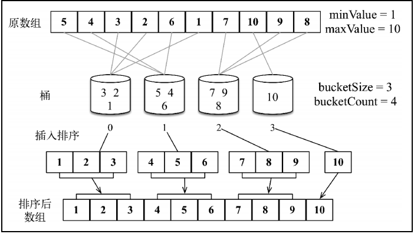

#### 数据结构排序
1. 冒泡排序(不建议使用)
2. 选择排序(不建议使用)
3. 插入排序(数据量小时，不错的算法)
4. 归并排序(不错的算法)
5. 计数排序(数据紧密, 空间换时间， 优秀算法)
6. 桶排序   
7. 快速排序 (优等算法)
8. 基数排序

## 冒泡
``` 
// 通过循环对比 将每一次比较的最大的值和没排序的最后一个索引的值进行交换
for(let i = 0; i < arr.length ; i ++;){
    for(let j = 1; j < arr.length - i; j ++){
        if(arr[j] < arr[j - 1]){
            [arr[j] , arr[j-1]] = [arr[j-1], arr[j]];
        }
    }
}


```

## 选择排序
```
// 其实和 冒泡排序差不多, 只是冒泡排序在冒泡的同时会将经过的元素进行整理
// 而选择排序， 只找到未排序中的最小值 往前放， 过程中不会交换其他元素的位置
let temp = arr[0];
for(let i = 0; i < arr.length; i ++){
    let index = i;
    for(let j = i; i < arr.length; j ++){
        if(arr[j] < temp){
            index = j
        }
    }
    if(index != i){
       [ arr[index ], arr[i]] = [arr[i], arr[index]];
    }
}

```

## 插入排序
```
let index = -1;
let temp = -1;
for(let i = 1; i < arr.length; i ++){
    index = i;
    temp = arr[index];
    while(temp < arr[index - 1] && index > 1){ // 这里的temp不能替换成arr[i] ， 因为进入while循环中 改变了 下标的值的 
        arr[index] = arr[index - 1];
        index --;
    }
    <!-- if(index != i){
        [arr[index],arr[i]] = [arr[i] , arr[index]];
    } -->
    arr[index] = temp;
}
```

## 归并排序
通过将大的数组 划分为一个个的小数组 进行递归排序
``` mergerSort
if(arr.length < 2){
    return arr;
}
let midle = Math.floor(arr.length / 2);
let left = mergerSort(arr, low, midle - 1); // 递归循环 直到数组的长度小于2 开始回溯
let right = mergerSort(arr, midle, hei);

let i = 0, j = 0;
let result = [];
while(i < left.length && j < right.length){
    if(left[i] < right[j]){
        result.push(left[i++]);
    }else {
        result.push(right[j++]);
    }
}
return result.concat(i < left.length ? left.slice(i) : right.slice(j));

```

## 计数排序
```
// 找到最大的元素
if(arr.length < 2) return arr;
let max = arr[0];
for(let i = 0 ; i < arr.length; i ++){
    if(arr[i] > max){
        max = arr[i];
    }
}
// 根据最大值创建长度数组, 这样 下标就是排序数组的元素值，  值就是排序数组元素的个数 (是不是应该要求数组必须是正整数啊)
let countArr = new Array(max + 1);
for(let i =0; i < arr.length; i ++){
    countArr[arr[i]] ++;
}
var result = [];
for(let i = 0; i < countArr.length; i ++){
    while(countArr[i] -- > 0){
        result.push(i);
    }
}

return result;

```

## 桶排序的过程

1. 根据数组中的最大 最小值， 和桶中元素的个数 确定 桶的个数 
2. 通过 element - min 除以 bucketSize 确定当前元素存储的桶的区间， 完成桶的修改
3. 将桶中的数据 拿出来使用排序算法进行排序， 再将排序的数据 进行整合 
``` 参数 (arr, bucketSize)
if(arr.length < 2){
    return arr;
}
let max = arr[0];
let min = arr[0];
for(let i = 0; i < arr.length; i ++){
    if(arr[i] > max){
        max = arr[i];
    }else if(arr[i] < min){
        min = arr[i];
    }
}

let ducketCount = Math.floor((max - min) / ducketSize) + 1;
let ducket = [];
for(let i = 0; i < ducektCount; i ++){
    ducket[i] = []; // 初始化桶
}
for(let i = 0; i < arr.length; i++){
    const index = Math.floor((arr[i] - min ) / ducketSize);
    ducekt[index].push(arr[i]); // 将数组分区分桶
}
let result = [];
for(let i = 0; i < ducket.length; i++){
    let sortArr = insert(ducket[i]);
    result.push(...sortArr); // 填入排序的数组
}
return result;


```

## 快速排序
> 选择一个数最为主元（也就是中间的那个数值), 然后将大于该数的元素放在右边， 把小于该数的元素放在左边， 重复

```
sort (arr, left, right){

    while(left <= right){
        let midle = arr[Math.floor((left + right) / 2)];
        while(arr[left] < midle && left <= right){
            left ++;
        }

        while(arr[right] > midle && left <= right>){
            right --;
        }
        if(left<= right){
            [arr[left], arr[right]] = [arr[right] , arr[left]]
            left ++;
            right --;
        }
    }
    return left;
}

quickSort(arr, left, right){
    if(left <= right){
        let midle = sort(arr, left, right);
        if(left < midle -1){
            quickSort(arr, left, midle-1);
        }
        if(right > midle){
            quickSort(arr,midle , right);
        }
    }
    return arr;
}

```


## 基数排序[书上的方法暂时没怎么明白]
> 将数组中的元素按照进制位数来排序 , 比如该数组是十进制的数组， 那么根据数组中最大值的位数来创建桶的个数， 每个桶中有十个空间用来排序当前位数中的排序, 然后组合即可

```
 function radixSort(arr, radixBase = 10) {
    if (arr.length < 2) return arr;
    let value = findMinMaxValue(arr);
    let min = value[0];
    let max = value[1];
    let base = 1;
    while ((max) / (base) >= 1) {
        arr = rSort(arr, radixBase, base, min);
        base *= radixBase;
    }

    return arr;
}

function rSort(arr, radixBase, ss, min) {
    var duckets = [],
        index = 0;
    for (let i = 0; i < radixBase; i++) {
        duckets[i] = [];
    }

    for (let i = 0; i < arr.length; i++) {
        index = Math.floor(arr[i] / ss) % radixBase;
        duckets[index].push(arr[i]);
    }
    console.log("桶中的数据 : " + duckets);
    var result = [];
    for (let i = 0; i < duckets.length; i++) {
        while (duckets[i].length > 0) {
            result.push(duckets[i].shift());
        }
    }
    return result;
}
```
